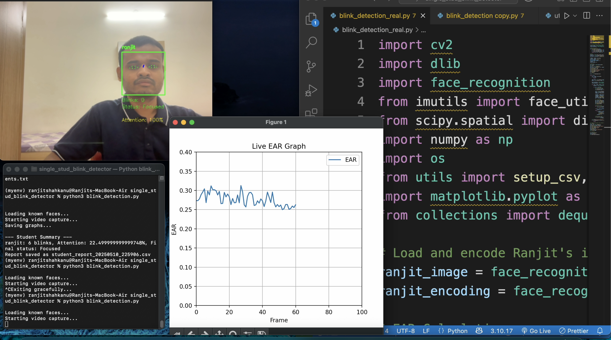

# Student Attention Monitoring System 👁️📈

[](docs/demo.mp4)

*An intelligent computer vision solution for real-time student engagement analysis in classroom environments*

## Key Features
- **Eye Blink Detection**: Implements Eye Aspect Ratio (EAR) algorithm for precise blink measurement
- **Facial Recognition**: Identifies registered students using dlib's facial landmarks
- **Engagement Analytics**: Generates attention span metrics and visual reports
- **Automated Reporting**: Exports session data to CSV for further analysis

## 🚀 Installation & Setup

### Prerequisites
- Python 3.8+
- pip package manager
- Internet connection (for model download)

### Step 1: Download Facial Landmark Model
```bash
# Download and decompress the pre-trained model (95MB)
wget http://dlib.net/files/shape_predictor_68_face_landmarks.dat.bz2
bunzip2 shape_predictor_68_face_landmarks.dat.bz2

# Move to models directory
mkdir -p models/
mv shape_predictor_68_face_landmarks.dat models/
